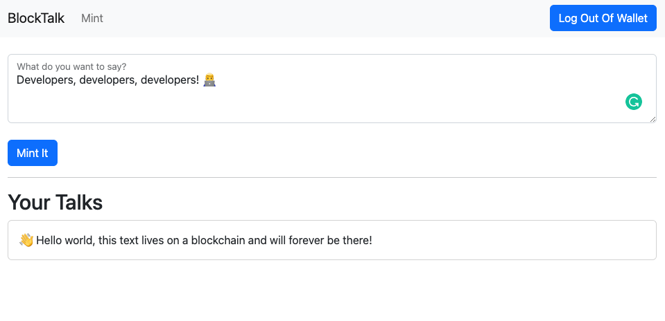

# 👋  Flow Web dApp Scaffold
We've created this scaffold to showcase a simple web application that mints tokens that contain tweet like posts. 
You are able to observe a web application setup using next.js and FCL (Flow javascript library). 
We've also created the contracts and transactions this application need to function.

**Here's an example of the application UI**


As you can see we can write different "talks" which in background are minted on the Flow network and displayed 
as a list. In order to mint this "talks" we use a development wallet, which you choose when 
signing in the application. Because the FCL handles authentication for you, there's no 
additional work required from a developer. If you are coming from Ethereum world you can 
think of it as Metamask but no extension required because it works as a library integrated 
into your application, making it work seamless. You can [read more about FCL and how it works here](https://developers.flow.com/tools/fcl-js#what-is-fcl).


## 🔨 Getting Started

### Prerequisites
- [Flow-CLI v0.44+](https://developers.flow.com/tools/flow-cli/install) 
- [Node v18](https://nodejs.org/en/download/)

### Components
- Flow CLI contains a lot of utilities and tools you can use during development
- [Flow Emulator](https://developers.flow.com/tools/emulator) is a simple version of a Flow network you run locally during development
- [Flow Dev Wallet](https://github.com/onflow/fcl-dev-wallet) is a tool that simulates a wallet provider, which is then consumed by FCL (Flow library used in the web application)

All of the above components can be run using the Flow CLI. 

## 👨‍💻 Setup

**1. Setup your project** (run in terminal)
```bash 
flow setup {your project name} --scaffold
```
Choose the `Web Dapp using FCL` scaffold.

_Here's an example_
```
flow setup my-project --scaffold

? Which scaffold would you like to use:
    Simple Cadence Project - Scaffold contains required folder structure as well as some example Cadence code.
  ▸ Web Dapp using FCL - Simple demo application using next.js and FCL with provided Cadence contracts.
```

_Alternatively you can just clone the Github project to your machine_
`git clone https://github.com/onflow/scaffold-flow.git`


**2. Install required packages**
```bash
npm install
```

## 🚧 Start Up

You can first run your application locally using the emulator and dev-wallet, 
any changes you make to the application will be updated automatically too. 
There is another testnet network you can also use to deploy this application, but 
that network is not hosted locally by you, but it's provided by Flow. So in order to run the 
application there you will need to follow couple additional steps.

### Local Emulator Deployment

**1. Start Emulator and Dev Wallet**
```bash
flow emulator & flow dev-wallet
```

**2. Deploy Contracts**

Running dev command will automatically deploy and update application contracts.

```bash
flow dev
```

**3. Build Web Application**

Running this command will build your next.js application.
```bash
npm run dev:local
```
**4. You're done!**

Open the application at http://localhost:3000

<button name="button" style="padding:15px;border:none;background-color:#00ef8b;font-weight:bold" onclick="http://localhost:3000">Open Application</button>

---

### Testnet Deployment
If you want to go further and deploy the dApp to our testnet you can proceed with the next steps.

**1. Create a Testnet Account**

Run the account create command and choose any name but pick the testnet network. 

```bash
flow accounts create
```
This is what you should see (the address and name will be different):
```
✔ Enter an account name: alice

? Choose a network:
    Emulator
  ▸ Testnet
    Mainnet
    
🎉 New account created with address 0x9e3251b6a0958efd and name alice on Testnet network.

Here’s a summary of all the actions that were taken:
 - Added the new account to flow.json.
 - Saved the private key to testnet.pkey.
 - Added testnet.pkey to .gitignore.
```

As written this created a new testnet account for us and saved the key to a separate file for improved security.

**2. Deploy Contracts**

Running project deploy command will deploy application contracts to testnet. 

_💡 We are not using flow dev command, since that is meant to be used during rapid local development which shouldn't be done on testnet._ 

First we need to add a testnet deployment for our contract by running:
```bash
flow config add deployment
```
And choosing the testnet as a network, the account name we just created, and the contract that needs to be deployed:
```
? Choose network for deployment:
    emulator
    mainnet
    sandboxnet
  ▸ testnet
  
? Choose an account to deploy to:
    ▸ alice
    emulator-account
    
? Choose contract you wish to deploy:
  ▸ BlockTalk
  
✔ testnet
✔ alice
✔ BlockTalk
✔ No
```
And then run this command to deploy our just configured deployment:
```bash
flow project deploy --network testnet --update
```

**3. Build Web Application**

Running this command will build your next.js application. We must replace the address with 
the account address we just created in the step 1. 
_You can look into flow.json if you cleared the output._
```bash
CONTRACT_ADDRESS={account address} npm run dev:testnet
```

<button name="button" style="padding:15px;border:none;background-color:#00ef8b;font-weight:bold" onclick="http://localhost:3000">Open Application</button>
