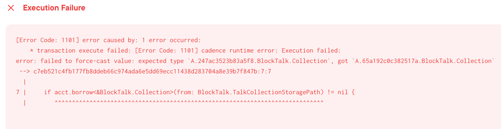

# Scaffold-Flow
🏗 Forkable Flow dev stack focused on fast product iterations

## Features Provided

- FCL setup and configuration
- Wallet Discovery (including Dev Wallet on Emulator)
- CLI private key separation for security
- Flow.json loading for contract placeholders
- Deployment 

## Featues TODO

- Mainnet deployment
- JS Testing

## Getting Started

### Prerequisites
- [Flow-CLI v0.44+](https://github.com/onflow/flow-cli) 
- [Node v18](https://nodejs.org/en/download/)

### Setup

1.  Clone/Fork 🏗 scaffold-flow repository to your local machine:
```bash
git clone https://github.com/onflow/scaffold-flow.git
```

2. install required packages:
```bash
cd scaffold-flow
npm install
```

## Running your App

You will be able to run you app locally on the flow emulator immediately after forking! For running on Testnet, you will need to make some configuration changes.

### Emulator

1. In your terminal, use this Flow-CLI command to initialize the flow blockchain emulator:
```bash
flow emulator start
```

2. In a different terminal, use this Flow-CLI command to initilize the Dev Wallet:
```bash
flow dev-wallet
```

3. In a different terminal, use this command to deploy your contracts. The client will automatically update you contracts as you develop!
```bash
flow dev
```

> Check flow.json to see if the generated address has the `0x` prefix. If it is missing, add it in yourself

```
 	"accounts": {
		"default": {
			"address": "0x0000000000000000", // make sure this address has the prefix!
			"key": "0000000000000000000000000000000000000000000000000000000000000000"
		},
		"emulator-account": {
			"fromFile": "./emulator.private.json"
		}
	},
```

4. Add the new address to your local `.env` file:
```
NEXT_PUBLIC_FLOW_NETWORK="emulator"
CONTRACT_ADDRESS="0x0000000000000000"
```

5. In a different terminal (Last one, promise!), use this command to deploy your contract(s) and initialize the App:
```bash
npm run dev
```
6. You're done! Checkout the App at http://localhost:3000

### Testnet

1. For running your app on Testnet, you will need a Testnet service account to deploy your app's contracts to. You can create one by using this Flow-CLI command. Follow the steps and select testnet. This will create a `testnet-account.private.json` file:
```bash
flow accounts create
Enter an account name: testnet
```

This will automatically create `./testnet.private.json` in your root directory as well as add a reference to the account in `flow.json`:

```
"accounts": {
		"emulator-account": {
			"fromFile": "./emulator.private.json"
		},
		"testnet": {
			"fromFile": "./testnet.private.json" // automatically generated
		}
	},
```

2. Then in `flow.json`, update the `contracts` field and add your testnet address prefixed with an `0x` as an alias for `testnet`:
```
	"contracts": {
		"BlockTalk": {
			"source": "./cadence/contracts/BlockTalk.cdc",
			"aliases": {
        "testnet": "0x0000000000000000" // testnet service account address goes here
			}
		}
	},
```

 Add the same `testnet` field to deploy the Blocktalk contract on testnet:

 ```
 "deployments": {
		"emulator": {
			"emulator-account": [
				"BlockTalk"
			]
		},
    "testnet": {       // add this object
      "testnet": [
        "BlockTalk"
      ]
    }
	},
 ```

3. Add your testnet service address to your local `.env` file:
```
NEXT_PUBLIC_FLOW_NETWORK="emulator"
CONTRACT_ADDRESS="0x0000000000000000"
```


4. Update the contract imports at [GetUserTalks.cdc](/cadence/scripts/GetUserTalks.cdc) and [CreateTalk.cdc](/cadence//transactions/CreateTalk.cdc) to this syntax for testnet

```
import BlockTalk from 0xBlockTalk
```

5. Use this command to deploy your contract(s) to the testnet service account and initialize the App in Testnet:
```bash
npm run dev:testnet:deploy
```

6. You're done! Checkout the App at http://localhost:3000

7. [Bonus] After changing your contracts, you can redeploy them to your testnet service account by running this command:
```bash
npm run dev:testnet:update
```

### TroubleShooting

Multiple Testnet Service Accounts:

Once the `BlockTalk` contract has been deployed to a service account, NFTs minted will be tied to this contract/service account. **IF** you deploy the same contract to a different service account, you are essentially duplicating the dapp between the 2 service accounts. This will cause your user to run into a fatal where the user is attempting to mint. (Will attempt to create the same storage path for 2 "different" dapps)


 